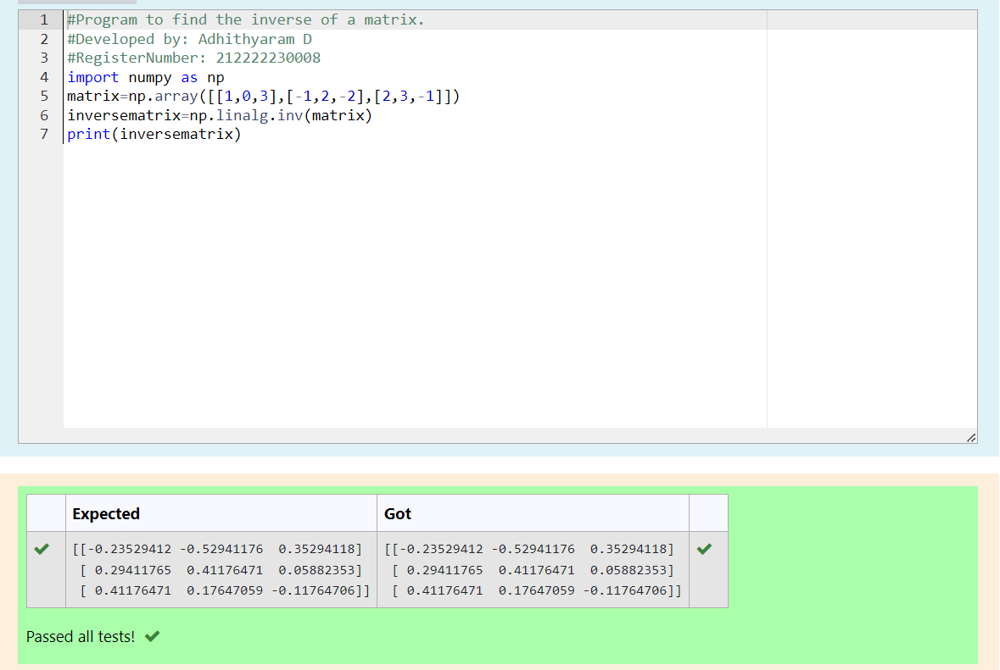

# INVERSE-OF-A-MATRIX
## Aim:
To write a python program to find the inverse of a matrix
## Equipment’s required:
1. 	Hardware – PCs
2. 	Anaconda – Python 3.7 Installation / Moodle-Code Runner
## Algorithm:
### Step1 : 
Import the numpy module to use the built-in functions for calculation
### Step 2: 
List the values in array
### Step 3: 
Using np.linalg.inv(), we can find the inverse of matrix
### Step 4: 
print the inverse of matrix
## Program:
```
#Program to find the inverse of a matrix.
#Developed by: Adhithyaram D
#RegisterNumber: 212222230008
import numpy as np
matrix=np.array([[1,0,3],[-1,2,-2],[2,3,-1]])
inversematrix=np.linalg.inv(matrix)
print(inversematrix)

```
## Output:

## Result:
Thus the inverse of given matrix is successfully solved using python program

